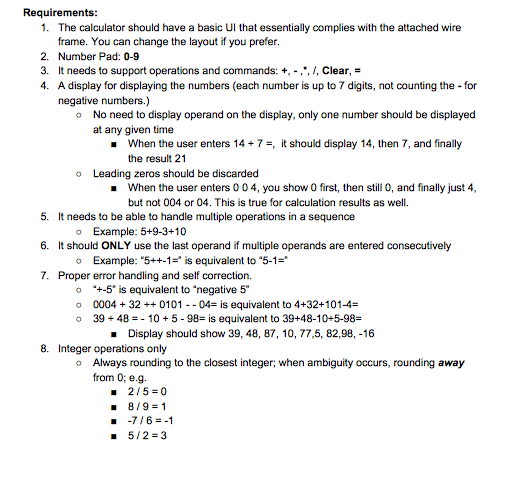
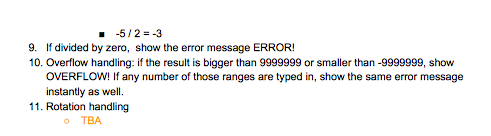
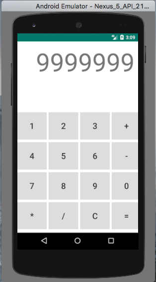
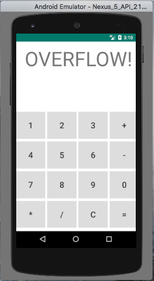
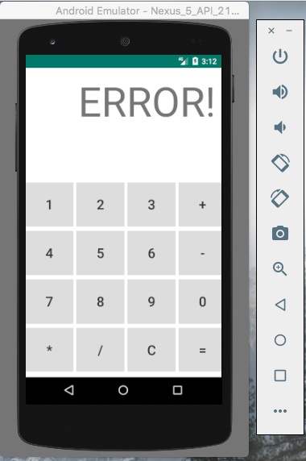
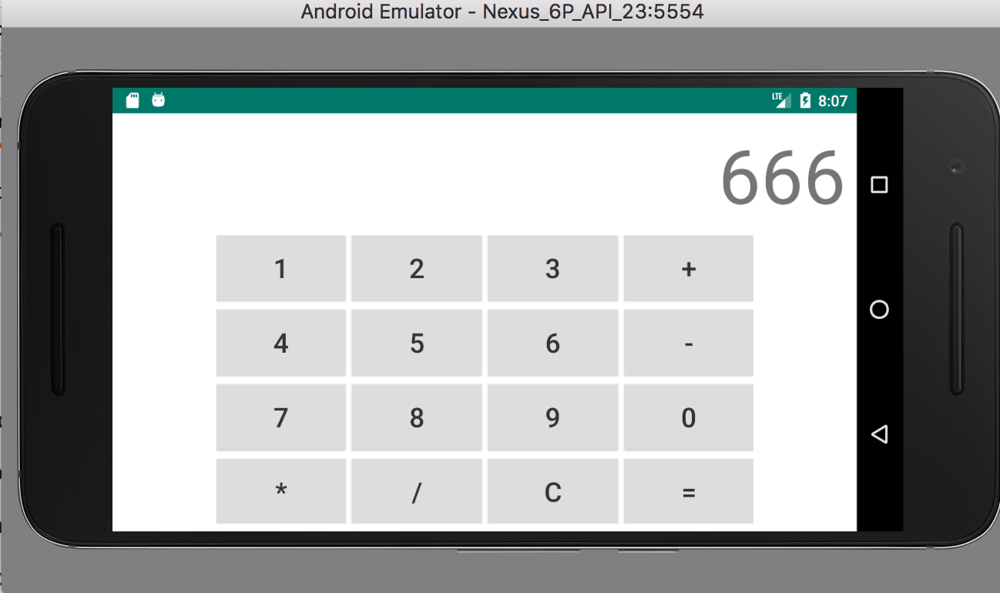

<h2>CMPE 277 Lab 1</h2>

 
An integer calculator that computes only integers on Android.  
Target API: <strong>23</strong>  
Minimum API: <strong>21</strong> 

<strong>A high level view of my application:</strong> 

In the project, IntegerCalculatorFragment is the view in which it host the 
xml file that contains the UI view. MainActivity is the controller. When a user 
clicks on a button, the fragment will configure the view and then send the 
message to MainActivity. The MainActivity contains the IntegerCalculatorHandler
that is the logic of the application. It handles the requirement and computes 
the values and send the message back to the activity. These messages are error, 
clear, computed value, and overflow. The MainActivity will than update the UI 
according to the message it recieves from its handler. The observer pattern is 
used to send messages. 

Here is a diagram of my application:  

Fragment -> MainActivity -> Handler->MainActivity->Fragment 

<a href="https://youtu.be/h3UowTWRk3k">Linked to demo of application</a> 
In the video I tested the application with the requirements from the lab  
Which can be found below.
<h3>Requirements</h3>

<h3>Screen Shots from Application</h3>

